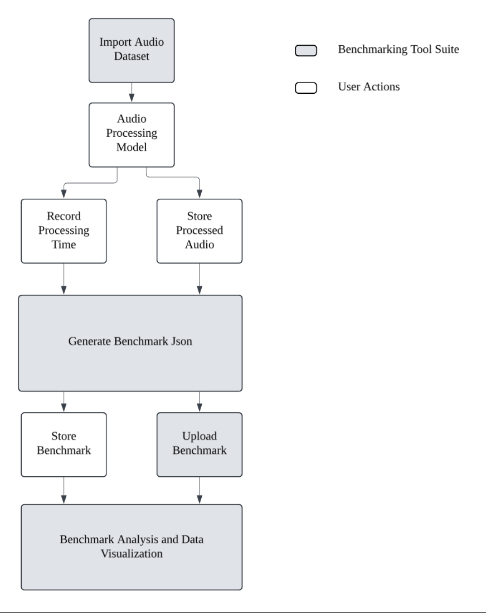

# Benchmark Generation – Team ECHO Benchmarking Tool Suite

## Overview

This tool generates structured benchmarks to evaluate audio processing models across diverse environmental conditions. Using Team ECHO’s labeled dataset, the notebook processes each `.wav` file through a selected model, computes evaluation metrics, and stores results in a JSON format for easy comparison and visualization.

## How It Works

1. **Import Dataset**  
   Load the full environmental audio dataset, which includes `.wav` files labeled by:
   - Environment: `Indoors`, `Crowded`, `Speaking`, `Walking`
   - Speaker: `Voice_Type`, `Voice_ID`
   - Location and duration metadata

2. **Run Benchmarking Notebook**  
   Use the `generate_benchmarks.ipynb` notebook to:
   - Process each `.wav` file through your audio model
   - Compute six audio quality metrics
   - Save results in a structured JSON format for comparison analysis

3. **Generate Benchmark JSON**  
   For each audio file, the benchmark includes:
   - Environmental and speaker metadata
   - Metrics:
     - Total Harmonic Distortion (THD)
     - Signal-to-Noise Ratio (SNR)
     - Noise Floor
     - Dynamic Range
     - Crest Factor
     - Waveform Complexity Index (WCI)

# High-Level Architecture of the Benchmarking Tool Suite

## Dataset

Download the labeled audio dataset here:  
[Google Drive – Team ECHO Dataset](https://drive.google.com/file/d/1T8BgIkIYePeYGhqIF8kHW1Nw-tcWQadU/view?usp=share_link)

After downloading, place the dataset in your project directory and update the path in the notebook as needed.

## Getting Started

1. Clone this repository
2. Download the dataset and place it in the working directory
3. Open and run `generate_benchmarks.ipynb`
4. Customize the model inference and metric computation code as needed
5. Review the generated JSON files for benchmarking and visualization

